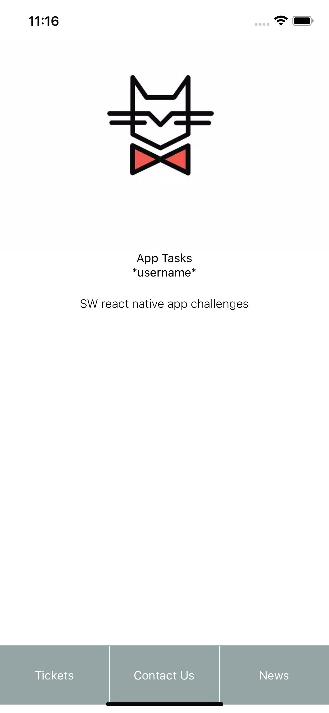
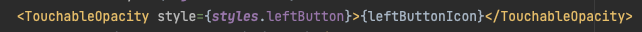

<!-- PROJECT LOGO -->
<br />
<div align="center">
  <a href="https://github.com/FraserKemp/JuniorAppTasks">
   
  </a>

<h3 align="center">Slimming world app Tasks</h3>

  <p align="center">
      Project of tasks following on from Reggie Dawsons tutorial on Plural sight
  </p>
</div>

<!-- TABLE OF CONTENTS -->
<details>
  <summary>Table of Contents</summary>
  <ol>
    <li>
      <a href="#about-the-project">About The Project</a>
    </li>
    <li>
        <a href="#installation">Installation</a>
    </li>
    <li><a href="#usage">Usage</a></li>
    <li><a href="#tasks">Tasks</a></li>
    <li><a href="#help">Help</a></li>
  </ol>
</details>

<!-- ABOUT THE PROJECT -->

## About The Project

<div align="center">
   <a href="https://github.com/FraserKemp/JuniorAppTasks">
      
   </a>
</div>
<br/>

<!-- GETTING STARTED -->

### Installation

1. Clone the repo
   ```sh
   git clone https://github.com/FraserKemp/JuniorAppTasks.git
   ```
2. Install yarn packages
   ```sh
   yarn install
   ```
3. Install the pods
   ```js
   cd ios && pod install
   ```

<p align="right">(<a href="#readme-top">back to top</a>)</p>

<!-- USAGE EXAMPLES -->

## Usage

This project is to help ease juniors / graduates into app feature creation with react native. This is a carry on from the Reggie Dawson tutorial on plural sight. We have added in some extra tasks to help easy you into writing react native code.

<!-- TASKS -->

## Tasks

If you are having any issues go through the help section below to help you resolve your issue

Make sure to read each point before fully before starting each one.

Only use the Hints available if you are absolutely stuck. Try your hardest to solve the tasks alone.

<ol>
   <li>
      <p>Once building the app you will see that there is no username on the home screen. Find where the username text is and add in your name so it shows</p>
   </li>
      <br/>
   <li>
   <p>Let's create a profile page called 'UserProfile' in 'src/components/pages/UserProfile'. In here we can create a UserProfile component that returns a 'Text' component with any placeholder text in.</p>
   <br/>
   <p>I have already added styles in ready for later on</p>
   </li>
      <br/>
   <li>Now we have the UserProfile Page created we need to access it. To do this we will utilize the Menu component we have used previously. Create a new button (TouchableOpacity) in the Menu component to access the UserProfile page. ( apply the same styles as the other buttons )</li>
   <br/>
   <li>
      <p>Currently the button isn't taking you anywhere. This is because we are using stack navigation and we have made no reference to the new UserProfile page yet. In App.js add in 'UserProfile' to your stack with 'Stack.Screen' with the options of "headerShown: false".</p>
      <br/>
      <p> Once you have done this we can now link the 'onPress' of the new menu button to take us to the new page with the 'navigation' prop we have available</p>
      <br/>
      <p>Now when you click the new menu button we should see our placeholder text we added inside the UserProfile screen component.</p>
   </li>
   <br/>
   <li>
      <p>In the user profile screen we want to show 4 things</p>
      <p>- Profile image</p>
      <p>- Username</p>
      <p>- Name</p>
      <p>- Bio</p>
      <p>(set the username, name, bio to anything relevant for now)</p>
      <br/>
      <p>We want the UserName, Name and Bio to be wrapped in a View with the style textContainer added onto it</p>
      <br/>
      <p>I have already added in a placeholder profile image in to the assets folder. However, it is not linked in the Images enum (Images.js file) Add in a new object property called 'userProfile' This will allow you to reference 'Images.userProfile' (see the home screen for an example)</p>
      <br/>

   </li>
   
   <li>
      <p>Now we have the placeholder text in the profile page. Check the style file and add on the relevant styles to the image, name, username and bio ( the style file was already created and should have the styles in there ready )</p>
   </li>
   <br/>
   <li>
      <p>You can see we have no page header meaning we can't navigate back. Now I would like you to create a 'PageHeader' component in 'src/components/PageHeader' directory. I have already created the style file with some styles ready to be added onto the SafeArea</p>
      <br/>
      <p>To start we would like the PageHeader component to use <a href="https://reactnative.dev/docs/safeareaview">SafeAreaView</a> so that we are safe from clipping the top section of the phone (see docs). Inside the SafeArea we just added just return some text out using the Text component for now e.g. Test Title</p>
      <br/>
      <p>The PageHeader will NOT show, this leads us onto our next task</p>
   </li>
   <br/>
   <li>
      <p>The page header is just a component we want to use in certain pages meaning we do NOT need a stack for it. To use the PageHeader component import it into the 'UserProfile' component and add the component above the image, so it sits at the top of the page</p>
      <br/>
      <p>you should now see The red page header showing on the user profile page now. If you are not ensure the styles have been added onto the PageHeader main container ( the SafeAreaView )</p>
      <br/>
      <p>Next we will refine the page header to take in props and be reusable!!</p>
   </li>
   <br/>
   <li>
      <p>Open up the PageHeader component ready to refine. We will want this component to take 5 props: </p>
      <p>- leftButtonIcon -  this will be the icon we want to show</p>
      <p>- leftButtonPress -  this will be the function we want to run when pressing the icon</p>
      <p>- title  - this will be the title of the screen</p>
      <p>- rightButtonIcon -  this will the right icon</p>
      <p>- rightButtonPress -  this will be the function we want to run when pressing the icon</p>
      <br/> 
      <p>Add in a TouchableOpacity as the first element in the SafeAreaView remember leftButtonIcon prop will be added inside similar to the title</p>
      <br/>
      <p>we will replace the placeholder text with the title prop we have access to e.g. {title}</p>
      <br/>
      <p>Add in another TouchableOpacity as the last element in the SafeAreaView remember rightButtonIcon prop will be added inside similar to the title</p>
      <br/>
      <p>The component should now show no title or icons on the header because we are not passing any props to the component. Similar to the first username task we did, pass the title 'User Profile' into the PageHeader component </p>
      <br/>
      <p>make sure to check the style file and add the relevant styles onto the touchable opacities and the title</p>
      <br/>
      <details>
         <summary>Hint (only if needed)</summary>
         <br/>
         <ol> 
            <li>
               <p>leftButton should be wrapped in a touchable opacity like so   </p> 
            </li>
            <li>pass in " title={'User Profile'} " to the PageHeader Tag</li>
         </ol>
      </details>
   </li>
   <br/>
   <li>
      <p>Adding in our first library! Now we want to create buttons using icons. This gives us the opportunity to use phosphor-react-native</p>
      <br/>
      <p>phosphor-react-native is a library that contains hundreds of free icons to use <a href="https://github.com/duongdev/phosphor-react-native">phosphor-react-native Github</a></p>
      <br/>
      <p>check the steps on the GitHub if you need help check out the help drop down below</p>
      <br/>
      <p>Once you have followed the steps run 'yarn install' and then a 'pod install' inside the ios folder</p>
      <br/>
      <details>
         <summary>Hint (only if needed)</summary>
         <br/>
         <ol>
            <li>install the library into our project using yarn: 'yarn add phosphor-react-native'</li>
         </ol>
      </details>
   </li>
   <br/>
   <li>
      <p>Lets get an icon showing. We want to use the arrow-left Icon. You can see a list of all the icons available here <a href="https://phosphoricons.com/">list of icons</a>. Search for arrow left to see how to add it to our file</p>
      <br/>
      <p>Once we know the code to get it into our file we want to pass the arrow-left into PageHeader as leftButtonIcon. Make sure you check you have imported the icon in from 'phosphor-react-native' </p>
      <br/>
      <p>Now when you reload the app you will see that it isn't working as we are getting an error. It will be mentioning  <a href="https://github.com/software-mansion/react-native-svg">'react-native-svg'</a> This is a library to give react native svg support and is a dependency of 'phosphor-react-native', this means it is required for the icons to work. An SVG file format is a popular tool for displaying two-dimensional graphics.</p>
      <br/>
      <p>check the docs and follow the installation process. use Yarn to install.</p>
      <br/>
      <details>
         <summary>Hint (only if needed)</summary>
         <br/>
         <ol>
            <p>Run these commands:</p>
            <li>yarn add react-native-svg</li>
            <li>yarn install</li>
            <li>cd ios && pod install</li>
         </ol>
      </details>
      <br/>
      <p>now you can reload the app and the left arrow icon should be showing!</p>
   </li>
   <br/>
   <li>
      <p>Lets add the second prop rightButtonIcon. We want to use the 'pencil-simple' icon from 'react-native-phosphor'. Again remember to add on the right button styles</p>
     <br/>
     <p>Feel free to have a search around the icons and pick a different one! We will later turn this into a very basic edit mode!</p>
   </li>
   <br/>
   <li>
      <p>The UI is now all there but the back button does nothing. That is because we haven't defined the onPress function for each TouchableOpacity in the 'PageHeader'</p>
      <br/>
      <p>Pass in the leftButtonPress prop to the PageHeader this will be a function that will run once the left button is presses. we want to navigate back to the home screen in this case.</p>
      <br/>
      <details>
         <summary>Hint (only if needed)</summary>
         <br/>
         <ol>
            <li>In the Menu component we have a similar thing. Each item has its own onPress function that navigates us to each page.</li>
         </ol>
      </details>
   </li>
   <br />
   <li>
      <p>We now want to create an edit mode within the UserProfile component</p>
      <br/>
      <p>The first thing we want to do is give the UserProfile page state, this will allow us to hold different values inside the component. we want to utalise <a href="https://reactjs.org/docs/hooks-state.html">useState</a> to do this and have two bits of state for now: editMode default to false, and name default to your name</p>
      <br/>
      <p>This will allow us to hold the state of the edit mode and the name we are changing in the TextInput in the next step</p>
   </li>
   <br />
   <li>
      <p>To get started editing lets get a TextInput showing in the UserProfile screen just below the 'name' Text.</p>
      <br />
      <p>TextInput is imported from 'react-native' and will need to be passed 3 props.</p>
      <ol>
      <li>onChangeText: this is a function that will run every time the text changes. e.g. we want to set the name state to the new value check the docs on how this is done</li>
      <li>value: This is the first value that is passed into the TextInput and what will show when we first see this component we will want this to be our name state!</li>
      <li>placeholder: this takes a string and is some placeholder text for when the field is empty e.g. Name</li>
      </ol>
      <br />
      <p>Check the docs on TextInput if you get stuck <a href="https://reactnative.dev/docs/textinput">DOCS</a>. I have also added in 'input' as a style in the style file so add that onto the TextInput</p>
   </li>
   <br />
   <li>
      <p>You should now see the name and then a TextInput right below. If you don't go back to step 15 to have another read through</p>
      <br />
      <p>We now want to do these same two steps for the username and the bio. For this we will need new state using useState and new TextInputs below each bit of the text</p>
   </li>
   <li>
      <p>You should now see 3 TextInput's where you can change the text in each one, if you don't see them go over steps 14 -> 16 again </p>
      <br />
      <p>Now we want to only show these TextInputs when we have edit mode enabled. First we will deal with setting editMode to true when pressing the top right button in the PageHeader.</p>
      <br/>
      <p>We have already made this easier for our sleves as we have a rightButtonPress prop where we can pass in a function that will execute what we want on press e.g. () => { // what we want to run in here }</p>
      <br/>      
      <p>Pass in the rightButtonPress prop to Pageheader and inside of the function set editMode to true. make sure PageHeader is using the rightButtonPress Prop</p>
      <details>
         <summary>Hint (only if needed)</summary>
         <br/>
         <ol>
            <li>you can console.log(editMode) above the return of the UserProfile page to see if it is changing when clicking the top right button</li>
         </ol>
      </details>
   </li>
   <li>
      <p>Now we can change edit mode between true and false we need to show the Inputs only when editMode is true. To do this we want to use the conditional operator. <a href="https://developer.mozilla.org/en-US/docs/Web/JavaScript/Reference/Operators/Conditional_Operator#:~:text=The%20conditional%20(ternary)%20operator%20is,if%20the%20condition%20is%20falsy.">read about conditionals here</a> </p>
      <br/>
      <p>for now lets just get it working with the name text and name input components</p>
      <br/>
      <p>When edit mode is {true ? we want to show text input here : or we show the name text here }</p>
      <details>
         <summary>Hint (only if needed)</summary>
         <br/>
         <ol>
            <li>when using code alongside components you have to wrap it in {}</li>
            <li>the conditional operator is a '?'</li>
            <li>Imagine the conditional operator as this sentence: if the variable infront of it is true show the first item ELSE if it is not true show the second item</li>
         </ol>
      </details>
   </li>
   <li>
      <p>Now when you first go to the screen you should see the text. But when you click the right header button you will see the TextInput instead of the text</p>
      <br/>
      <p>Now do step 18 for the username and the bio as well</p>
   </li>
   <li>
      <p>We now have an edit mode working but no way to get out of edit mode. Let's add a button at the bottom of the component but in the main view using (TouchableOpacity) that shows the word 'Save'. use menu component for inspiration</p>
      <br/>
      <p>add on the button styles I have added. TouchableOpacity can take a onPress function. Have a go at setting editMode to false when clicking the button</p>
   </li>
   
  </ol>

<!-- HELP -->

## HELP

- React native navigation Docs (https://reactnavigation.org/docs/native-stack-navigator/)
- React native docs - you can search for any component in here as well (https://reactnative.dev/docs/getting-started)
- If something isn't working sometimes the error message can guide you in the right direction.
- google and stack overflow is a developers best friend! sometimes the solution has already been found by someone else.
- Check your imports. If you are getting errors that state it 'Can't find variable: "component name" ' then you may be missing an import.
- Pressing 'cmd + d' you can select 'debug with chrome' this will alow you to link to the React Native debugger app.
- Make use of console logs with your debugger you can console log anything out above the return of a component.
- Check the spelling, sometimes something as small as a spelling mistake can trip you up.
- using webstorm you can double tap 'shift' to then search for a file.
- using webstorm you can press 'shift + cmd + F' to then search all files/ a specific directory for a specific key word.
- A react component can only return one element! You cant return two views from a component you must only return one.
